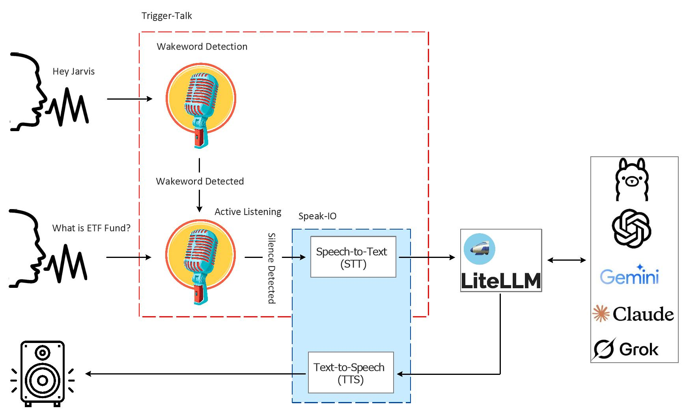

# LLM-Talk

LLM-Talk is a conversational interface that transforms traditional chatbot interactions into a natural, voice-driven experience with a large language model (LLM). Instead of typing prompts and reading responses, users engage the system through spoken language. A configurable hotword activates the system's listening mode, allowing users to ask questions or make requests verbally. The audio input is transcribed into text, sent to an LLM for inference, and the generated response is converted into speech and played back to the user. This creates a hands-free low-latency conversational flow, similar to interacting with a virtual assistant, but powered by the reasoning capabilities of modern LLMs.

## System Architecture

The architecture of LLM-Talk is composed of modular components. At the core of the system is [Trigger-Talk](https://github.com/ManiAm/Trigger-Talk), a hotword detection engine responsible for activating the listening mode upon detecting a predefined wake word. Once activated, the user's speech is processed by [Speak-IO](https://github.com/ManiAm/Speak-IO), a component that handles both speech-to-text (STT) and text-to-speech (TTS) conversion. Speak-IO ensures accurate transcription of the user’s input and natural-sounding audio playback of the model's response.

For LLM integration, we leverages [LiteLLM](https://www.litellm.ai/), a lightweight and extensible framework that abstracts over various language model providers such as OpenAI, Anthropic, Mistral, HuggingFace, and more. This allows users to easily switch between different LLM backends without changing application logic, offering flexibility for experimentation, cost optimization, or performance tuning. The system is built with asynchronous, event-driven components to ensure responsiveness, real-time feedback, and graceful handling of concurrent tasks. You can find more explanation on LiteLLM setup in my home network in [here](https://blog.homelabtech.dev/content/Local_LLM_Hosting.html#LiteLLM).

### LLM Response Streaming

In traditional setups, handling LLM responses with blocking calls can introduce significant latency, as the entire response must be received before any further processing occurs. This delay negatively affects responsiveness and is not practical for voice-driven interfaces. To address this, LLM-Talk utilizes streaming responses from the LLM. As each chunk of text is received, it is immediately cleaned, segmented into complete sentences, and forwarded to the text-to-speech engine for playback. This allows near real-time speech synthesis, significantly improving user experience and reducing perceived lag.

### Conversational Memory

LLM-Talk maintains an in-memory conversation history that gives the language model contextual awareness throughout a session. By appending each user prompt and model response to the memory buffer, the LLM is able to handle follow-up questions or references to previous exchanges. This conversational memory enables more natural, coherent interactions similar to a real conversation where context is preserved across turns. The memory is trimmed to a configurable size to manage performance and avoid exceeding model token limits.

### Interruptible TTS Playback

To support dynamic and responsive interactions, LLM-Talk allows users to interrupt ongoing text-to-speech playback. If a hotword is detected during the response narration, the system immediately stops the audio output and switches back to active listening mode. This capability is essential for real-time dialog, where users may wish to correct, stop, or rephrase their queries without waiting for the LLM to finish speaking. It also mirrors natural conversation flow, where participants can interject or redirect as needed.

### Configuration

LLM-Talk is designed to be highly configurable, allowing users to tailor the system to their specific needs and preferences. The [configuration](./config.py) covers various components of the pipeline, including:

- **Hotword Detection**: Parameters such as the hotword phrase, model type, silence duration, etc. can be adjusted to optimize for different environments.

- **LLM Backend**: The underlying large language model can be easily switched using LiteLLM. This enables unified experimentation across different LLM ecosystems.

- **Speech-to-Text (STT)** and **Text-to-Speech (TTS)**: Users can configure the STT and TTS engines along with specific models or voices, providing fine-grained control over language support, voice style, and transcription accuracy.

## Demo

[demo.mp4](https://github.com/user-attachments/assets/413b6d30-0ebc-4b40-b3e7-07bcfbc61427)

-----------------

integrate with freepbx voice system
